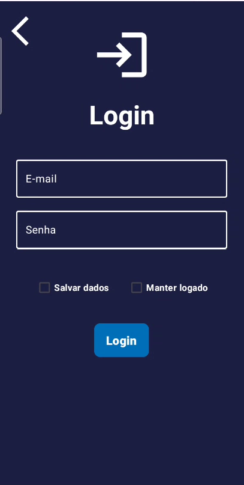
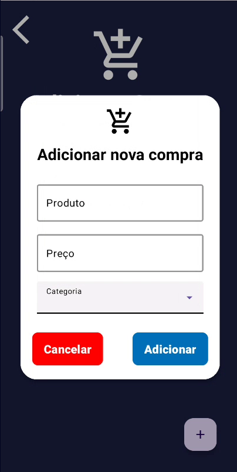
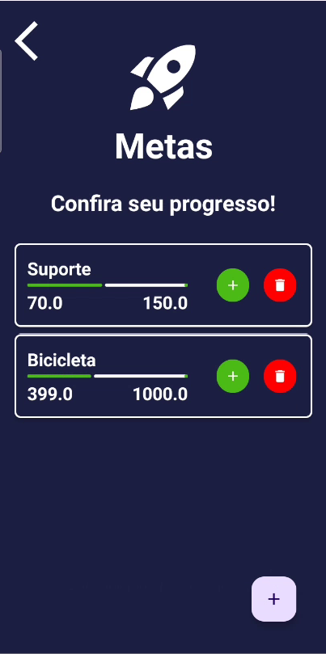
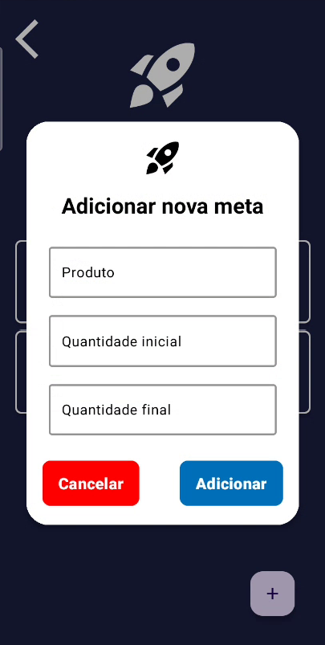
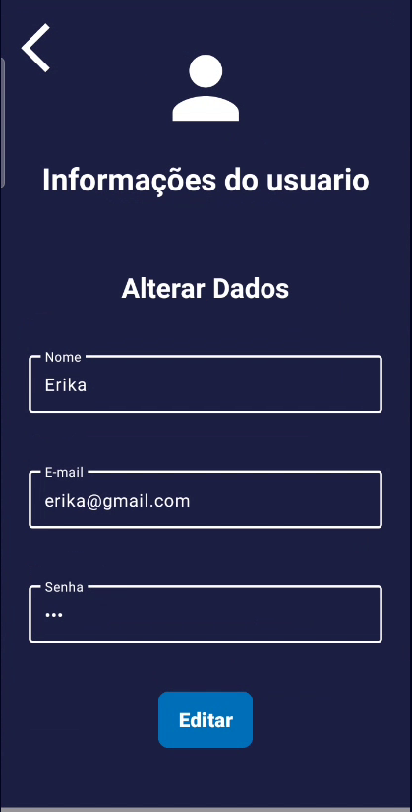
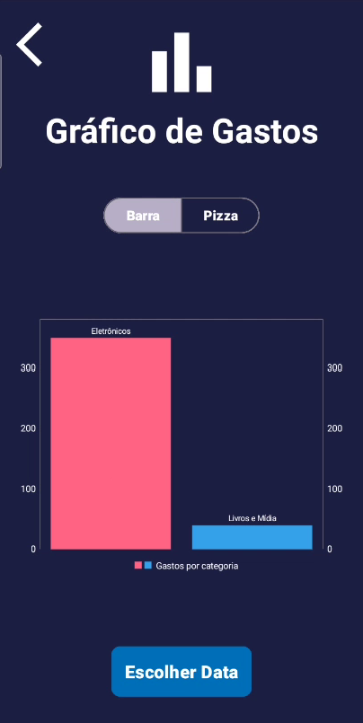
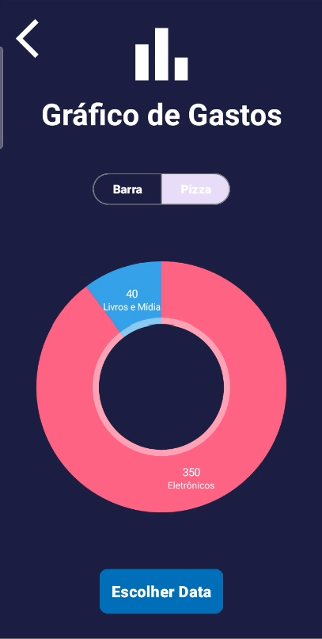
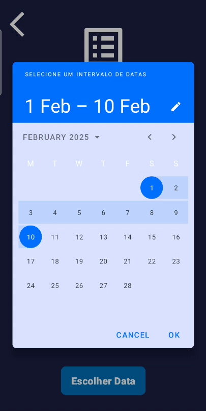

# 💰 Finance Up

O **Finance Up** é um aplicativo desenvolvido para ajudar os usuários a acompanharem seus gastos e terem uma visão clara de suas atividades financeiras. Com recursos gráficos e relatórios detalhados, o app busca auxiliar no controle financeiro e na criação de metas, ajudando as pessoas a lidarem melhor com o dinheiro e evitarem endividamentos.

---

## ✨ Funcionalidades

### 🔹 Registro e Cadastro de Usuário  
Permite que novos usuários se cadastrem e façam login no aplicativo.

  

### 🔹 Registro, Edição e Remoção de Compras  
Os usuários podem registrar suas compras, editá-las ou removê-las caso necessário.

  

### 🔹 Criação e Exclusão de Metas Financeiras  
Possibilidade de definir metas financeiras, como juntar R$4000 ou economizar para uma viagem.

  

### 🔹 Atualização de Dados do Perfil  
Usuários podem modificar informações do perfil diretamente pelo aplicativo.

### 🔹 Visualização de Gastos em Gráficos  
Os gastos são apresentados em gráficos de barra e pizza, agrupados por categorias, com opção de filtro por datas.

  

### 🔹 Histórico de Compras
Permite visualizar o histórico de transações por data.

---

## 📌 Especificações do Projeto

- **📱 IDE:** Android Studio 2024.1.2  
- **⚡ Linguagem:** Kotlin  
- **📲 Min API:** 30  
- **📂 Banco de Dados:** Room  
- **📊 Biblioteca de Gráficos:** MPAndroidChart (com.github.PhilJay:MPAndroidChart:3.1.0)  

---

# 🚀 Instalação do Aplicativo

Para utilizar o **Finance Up**, siga os passos abaixo:

## 1️⃣ Download do APK  
Baixe o APK diretamente no link abaixo:

🔗 **[Download do APK](#)** *(Substituir pelo link real)*

## 2️⃣ Instalação no Android  
1. No seu dispositivo, abra **Configurações > Segurança** e ative a opção **Fontes desconhecidas** (caso o Android solicite permissão para instalar aplicativos externos).
2. Localize o arquivo APK baixado no seu gerenciador de arquivos.
3. Toque no APK para iniciar a instalação.
4. Aguarde a instalação ser concluída e abra o aplicativo!

Agora você pode começar a gerenciar suas finanças! 🚀📊

---

## 👨‍💻 Desenvolvedores

| Nome | RA |
|-------|------|
| Luis Henrique Aguiar dos Santos | AQ302234X |
| Érika Santana Alves | AQ3022722 |
| Cristiano Rodrigues de Oliveira | AQ3022641 |
| Matheus Mantovani Gonçalves | AQ3022927 |
